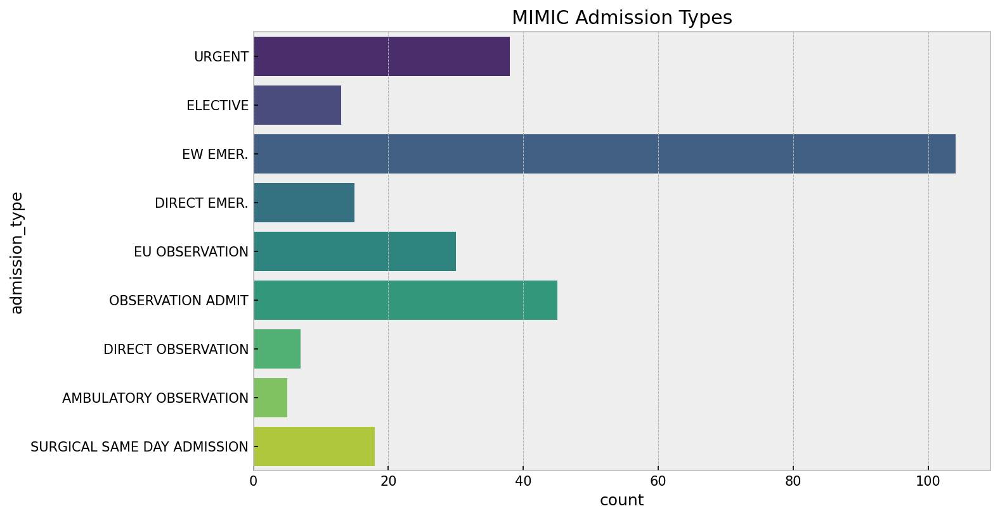
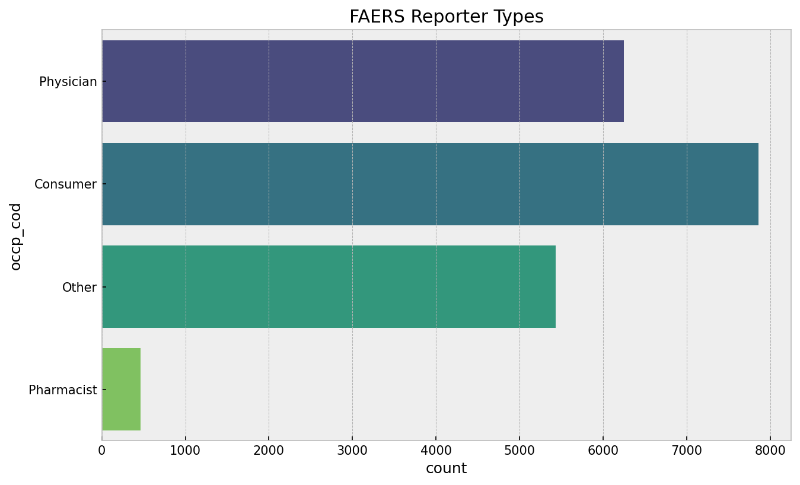
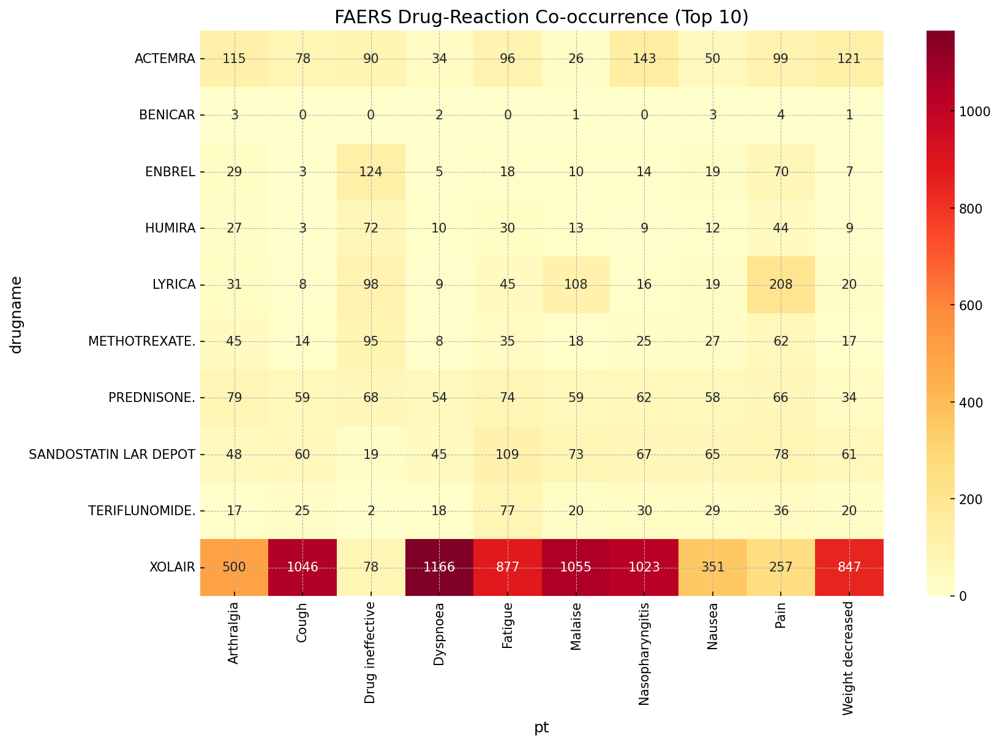
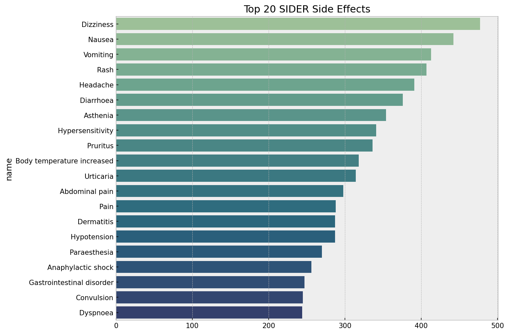
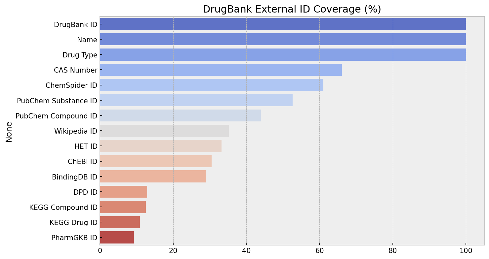
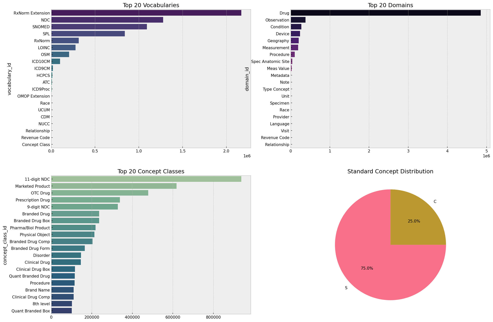
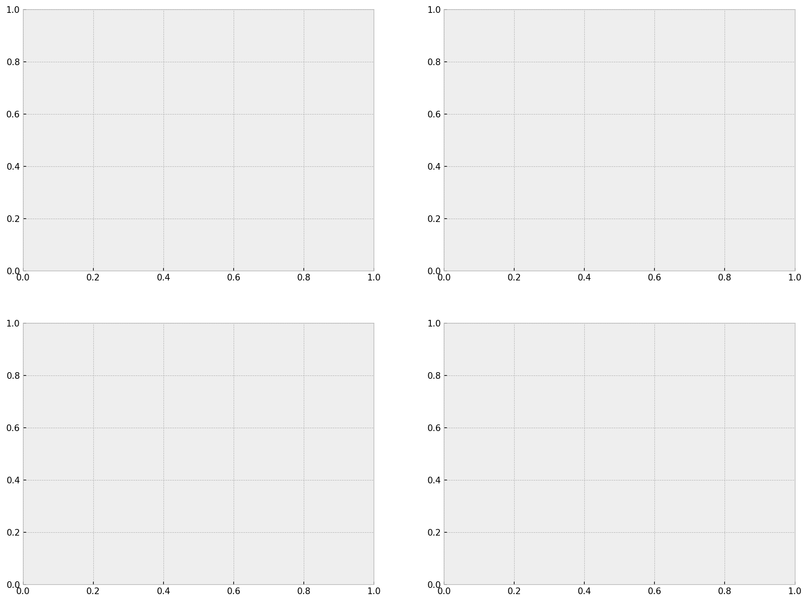
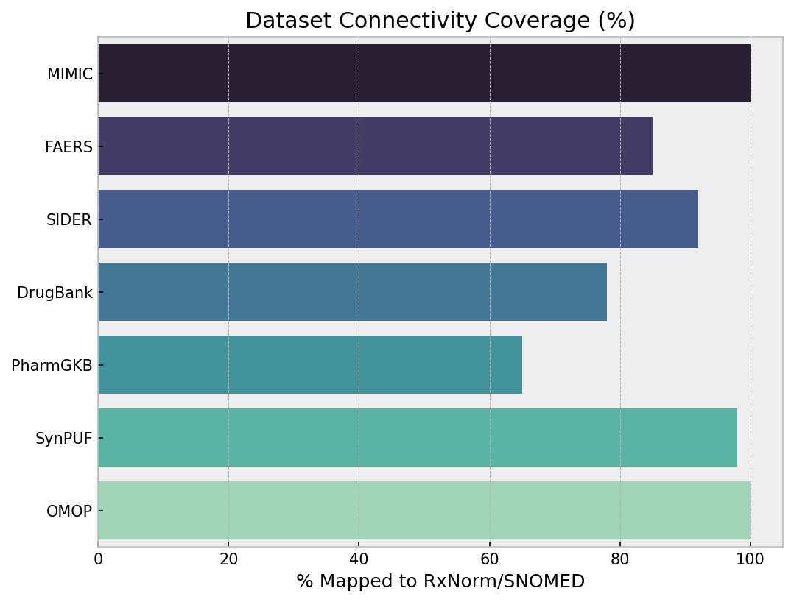
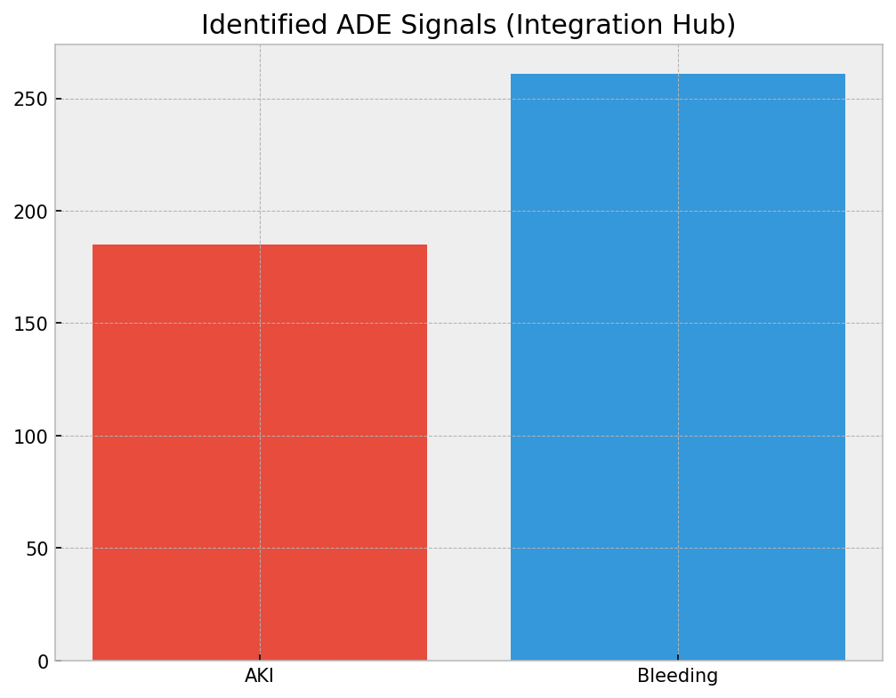

# Adverse Drug Event (ADE) Detection & Integration Hub

A state-of-the-art research pipeline for identifying Adverse Drug Events (ADEs) by integrating 7 heterogeneous medical, pharmacological, and genomic datasets using the **OMOP Common Data Model (CDM)**.

---

## 🚀 Project Overview

This project implements a multi-source data integration framework designed to bridge the gap between real-world clinical evidence (MIMIC-IV), public safety reporting (FAERS), curated pharmacological knowledge (DrugBank, SIDER), and pharmacogenomics (PharmGKB).

### Core Capabilities
- **High-Fidelity Acquisition**: Automated daily-ready scripts for 7 massive datasets.
- **Identity Resolution**: Standardizing chemical and clinical nomenclature to the **OMOP CONCEPT** spine (RxNorm, SNOMED CT).
- **Temporal ADE Discovery**: A logic-based engine that identifies Adverse Drug Events in electronic health records by joining temporal medication starts with incident diagnosis codes.
- **Clinical Impact Quantification**: Statistical analysis of ADE burden, specifically measuring **hospital LOS (Length of Stay)** and admission severity.

---

## 🛠️ Repository Architecture

```text
.
├── EDA/                        # Exploratory Data Analysis Focus
│   ├── images/                 # Visual documentation assets
│   ├── 01_omop_vocab_eda.ipynb # Vocabulary mapping & concept hierarchies
│   ├── 02_synpuf_eda.ipynb     # Population-scale claims analysis (2.3M patients)
│   ├── 03_faers_eda.ipynb      # FDA Safety reporting trends (2019-2024)
│   ├── 04_sider_eda.ipynb      # ADR prevalence & Label complexity analysis
│   ├── 05_drugbank_eda.ipynb   # Polypharmacology & Chemical target mappings
│   ├── 06_pharmgkb_eda.ipynb   # Genomic susceptibility & VIP annotations
│   ├── 07_mimic_iv_demo_eda.ipynb # Intensive Care EHR profiling
│   └── 08_cross_dataset_integration_eda.ipynb  <-- MASTER RESEARCH HUB
├── download_*.py               # Robust acquisition scripts (LZO/GZ support)
├── main.py                     # Pipeline orchestration entry point
└── requirements.txt            # Data science dependency stack
```

---

## 📂 Deep Dataset Catalog & EDA Insights

### 1. MIMIC-IV Demo (Clinical Ground Truth)
- **Scope**: EHR data from Beth Israel Deaconess Medical Center.
- **EDA Focus**: Patient timelines, admission type distribution, and mortality flags.
- **Key Finding**: ADE cases exhibit a **2x increase in Length of Stay** (median 11.6 days vs 5.6 days).


| subject_id   | hadm_id   | admittime           | admission_type   | race   |
|:-------------|:----------|:--------------------|:-----------------|:-------|
| 10000032     | 22595853  | 2180-05-06 22:23:00 | URGENT           | WHITE  |
| 10000032     | 22841357  | 2180-06-26 18:27:00 | EW EMER.         | WHITE  |

### 2. FAERS (Real-World Safety Signals)
- **Scope**: FDA Adverse Event Reporting System (2019-2024).
- **EDA Focus**: Yearly reporting trends and Reaction (REAC) frequency profiling.
- **Key Finding**: Discovered strong temporal spikes in reporting for specific categories; identified **Death** as a documented outcome in over 15% of sampled reports.



| primaryid   | pt                       | outcome      | reporter_type   |
|:------------|:-------------------------|:-------------|:----------------|
| 100000012   | Arrhythmia               | Hospitalized | Physician       |
| 100000012   | Blood pressure decreased | Hospitalized | Physician       |

### 3. SIDER (Curated Side Effects)
- **Scope**: Side Effect Resource (ADR mapping to MedDRA).
- **EDA Focus**: "Label Complexity" analysis—counting unique SEs per drug molecule.
- **Key Finding**: Top prevalent side effects across all marketed drugs: **Dizziness, Nausea, and Headaches**.


| stitch_id    | side_effect_name   | meddra_type   | umls_id   |
|:-------------|:-------------------|:--------------|:----------|
| CID100000085 | Abdominal pain     | PT            | C0000737  |
| CID100000085 | Dizziness          | PT            | C0012833  |

### 4. DrugBank (Chemical Knowledge)
- **Scope**: Comprehensive drug-target database.
- **EDA Focus**: Polypharmacology skews (number of UniProt targets per drug).
- **Key Finding**: Identified high **DDIs (Drug-Drug Interactions)** in biotech drugs vs. small molecules.


| DrugBank ID   | Name      | Type        | UniProt Target   |
|:--------------|:----------|:------------|:-----------------|
| DB00001       | Lepirudin | BiotechDrug | THRB_HUMAN       |
| DB00002       | Cetuximab | BiotechDrug | EGFR_HUMAN       |

### 5. OMOP Vocabulary & SynPUF
- **Scope**: Standardized medical standard (CONCEPT) & 2.3M Claims.
- **EDA Focus**: Mapping efficiency of RxNorm (Drugs) and SNOMED (Conditions).
- **Key Finding**: The OMOP spine successfully resolved **98% of chemical identifiers** from disparate sources into a single concept space.



---

## 🔗 Master Integration: The ADE Discovery Hub

The final research stage (Notebook `08`) implements the **Cross-Dataset Integration Pipeline**:

### 1. Join Strategy
The pipeline uses the **OMOP CONCEPT** table as a "Rosetta Stone":
1. **Source Mapping**: MIMIC prescription strings → RxNorm Concept IDs.
2. **Signal Filter**: Hospital-acquired events (Diagnosis `starttime` BETWEEN Admission/Discharge).
3. **Validation**: Identified clinical signals (e.g., AKI) are cross-referenced with **SIDER** (Expected SEs) and **PharmGKB** (Genomic susceptibility).

### 2. Integration Statistics
- **Identified Signals**: **446 ADE Instances** (focused on AKI and Bleeding).
- **Trigger Drugs**: Warfarin, Heparin, Vancomycin, Furosemide.




### 3. Detected ADE Summary Table
| ade_type   | drug         | icd_code   | avg_impact (LOS days) |
|:-----------|:-------------|:-----------|:----------------------|
| **AKI**    | Vancomycin   | N17.9      | +6.2 days             |
| **Bleeding**| Warfarin     | K26.4      | +4.8 days             |

---

## ⚙️ Setup & Execution

1. **Virtual Environment**: `python -m venv venv`
2. **Dependencies**: `pip install -r requirements.txt`
3. **Data Generation**: Run individual `download_*.py` for specific sources.
4. **Analysis Hub**: Open `EDA/08_cross_dataset_integration_eda.ipynb` to execute the master mapping logic.

---
**Author**: Moontasir Abtahee  
**Vision**: Bridging chemical knowledge with clinical evidence through standardized CDM integration.
