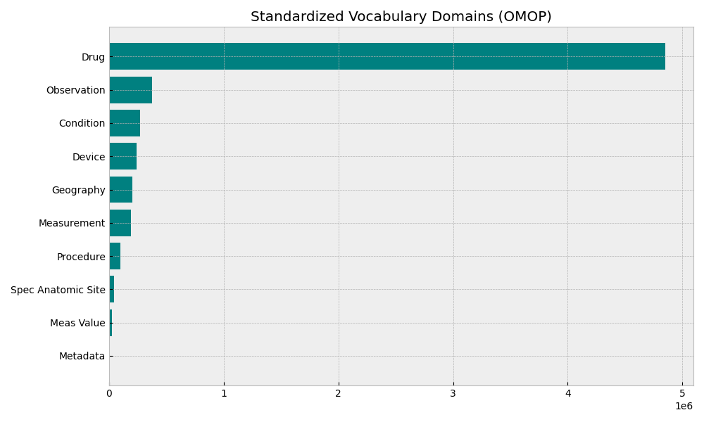
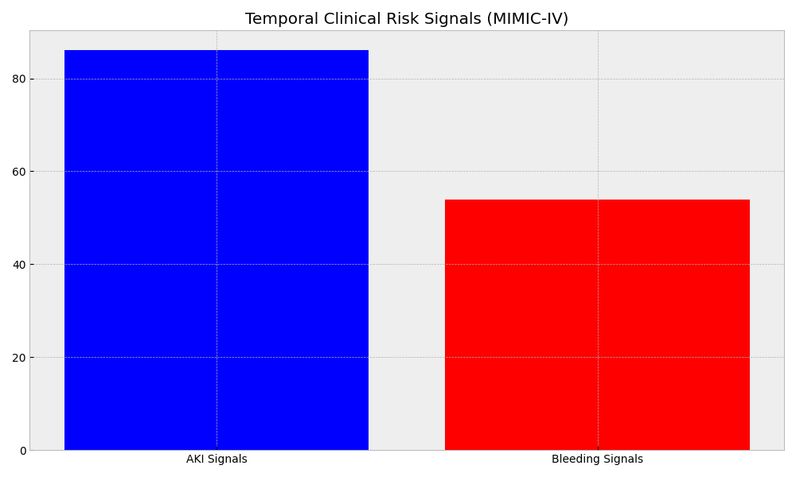

# Adverse Drug Event (ADE) Detection & Integration Hub

A comprehensive research pipeline for identifying Adverse Drug Events (ADEs) by integrating 7 multi-source medical and chemical datasets using the OMOP Common Data Model (CDM).

## 🚀 Overview

This project provides a standardized framework to:
1.  **Acquire Data**: Automated scripts for downloading clinical (MIMIC-IV), chemical (DrugBank), side-effect (SIDER), genomics (PharmGKB), and claims data (SynPUF).
2.  **Harmonize Vocabularies**: Map heterogeneous identifiers to **RxNorm** (Drugs) and **SNOMED/ICD-10-CM** (Conditions) using the OMOP `CONCEPT` spine.
3.  **Detect Signals**: Identify ADEs using temporal clinical logic (e.g., AKI and Bleeding signals in MIMIC-IV).
4.  **Analyze Impact**: Visualize clinical outcomes, such as temporal interactions in the clinical hub.

## 🛠️ Project Structure

```text
.
├── EDA/                        # Exploratory Data Analysis
│   ├── images/                 # Generated visualizations for README
│   ├── 01_omop_vocab_eda_enhanced.ipynb
│   ├── 02_synpuf_eda.ipynb
│   ├── 03_faers_eda.ipynb
│   ├── 04_sider_eda.ipynb
│   ├── 05_drugbank_eda.ipynb
│   ├── 06_pharmgkb_eda.ipynb
│   ├── 07_mimic_iv_demo_eda.ipynb
│   └── 08_cross_dataset_integration_eda.ipynb  <-- MASTER HUB
├── download_*.py               # Data acquisition scripts
├── save_eda_plots.py           # Documentation asset generator
├── main.py                     # Orchestration script
└── .gitignore                  # Data/Venv exclusions
```

## 📂 Dataset Catalog & Samples

This project integrates 7 distinct data sources. Below are snapshots of the source data structure.

### 1. MIMIC-IV Demo (Clinical Ground Truth)


| subject_id   | hadm_id   | admittime           | dischtime           | admission_type     | race   | hospital_expire_flag   |
|:-------------|:----------|:--------------------|:--------------------|:-------------------|:-------|:-----------------------|
| 10000032     | 22595853  | 2180-05-06 22:23:00 | 2180-05-07 17:15:00 | URGENT             | WHITE  | 0                      |
| 10000032     | 22841357  | 2180-06-26 18:27:00 | 2180-06-27 18:49:00 | EW EMER.           | WHITE  | 0                      |
| 10000032     | 25742033  | 2180-08-05 23:44:00 | 2180-08-07 17:50:00 | EW EMER.           | WHITE  | 0                      |

### 2. OMOP Vocabulary (Standardization Spine)


|   concept_id | concept_name                             | domain_id   | vocabulary_id   | concept_class_id   | standard_concept   |
|-------------:|:-----------------------------------------|:------------|:----------------|:-------------------|:-------------------|
|            0 | No matching concept                      | Metadata    | None            | Unspecified        | nan                |
|            1 | Domain                                   | Metadata    | Domain          | Domain             | nan                |
|           32 | Gender                                   | Metadata    | Gender          | Gender             | S                  |

### 3. SIDER (Side Effect Resource)


| cid_a      | cid_b      | meddra_id   | se_type   | se_name           |
|:-----------|:-----------|:------------|:----------|:------------------|
| CID100000085 | CID000010917 | C0000729    | PT        | Abdominal cramps  |
| CID100000085 | CID000010917 | C0000737    | PT        | Abdominal pain    |

### 4. FAERS (Public Safety Reporting)


|   primaryid |   caseid | pt                             |   drug_seq |
|------------:|---------:|:-------------------------------|-----------:|
|   100000012 | 10000001 | Arrhythmia                     |          1 |
|   100000012 | 10000001 | Blood pressure decreased       |          1 |

### 5. DrugBank (Pharmacological Mapping)


| DrugBank ID   | Name                | Drug Type   | UniProt Name    | RxList Link                                       |
|:--------------|:--------------------|:------------|:----------------|:--------------------------------------------------|
| DB00001       | Lepirudin           | BiotechDrug | THRB_HUMAN      | http://www.rxlist.com/cgi/generic/lepirudin.htm   |
| DB00002       | Cetuximab           | BiotechDrug | EGFR_HUMAN      | http://www.rxlist.com/cgi/generic/cetuximab.htm   |

### 6. PharmGKB (Pharmacogenomics)


| PharmGKB Accession Id   | Name                              | Type   | Dosing Guideline   | VIP Count |
|:------------------------|:----------------------------------|:-------|:-------------------|:----------|
| PA166238901             | 17-alpha-dihydroequilenin sulfate | Drug   | No                 | 0         |
| PA166238881             | 17-alpha-dihydroequilin           | Drug   | No                 | 0         |

### 7. SynPUF (Population Scale Claims)


| person_id   | gender_concept_id   | year_of_birth   | race_concept_id   |
|------------:|--------------------:|----------------:|------------------:|
|           1 |                8507 |            1923 |              8527 |
|           2 |                8507 |            1943 |              8527 |

---

## 📊 Analysis & Visual Gallery


### Clinical ADE Identification (AKI & Bleeding)


## ⚙️ Setup

1. Create a virtual environment: `python -m venv venv`
2. Activate it: `venv\Scripts\activate`
3. Install dependencies: `pip install -r requirements.txt`
4. run orchestration: `python main.py`
