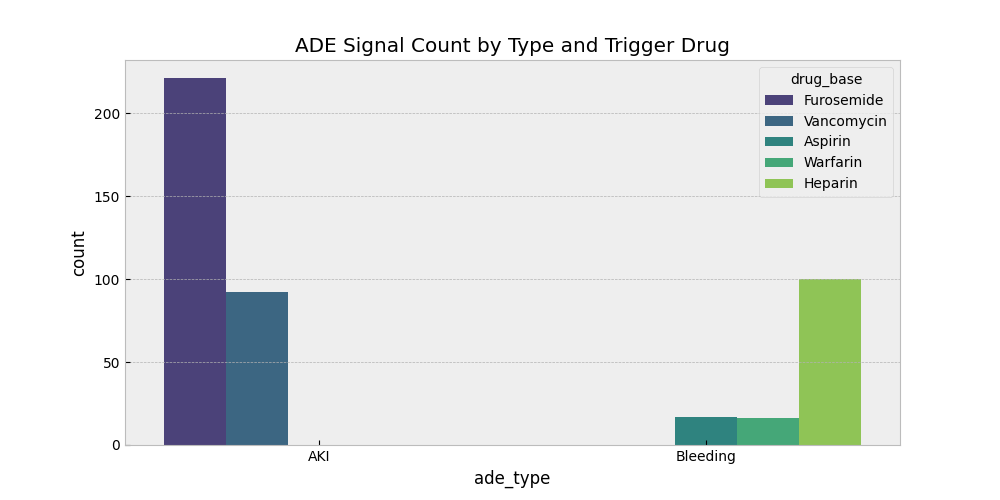
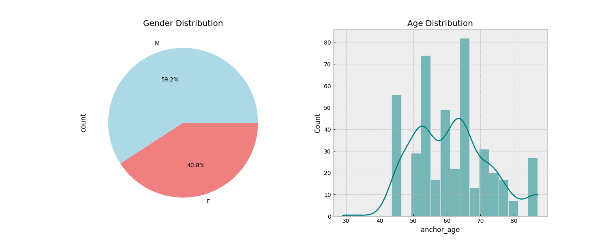
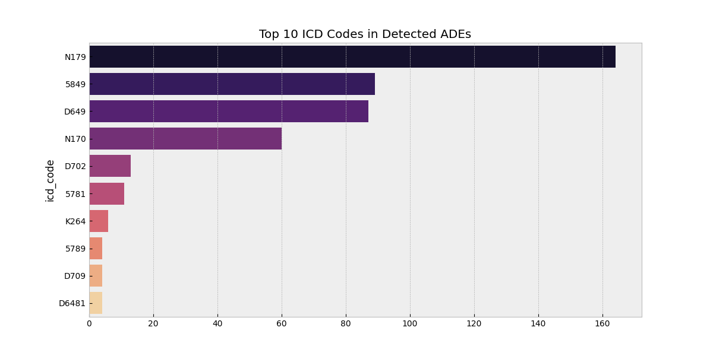
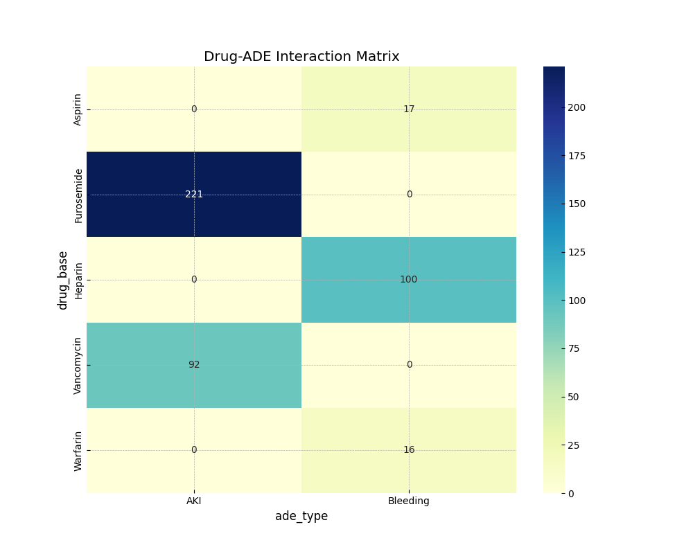
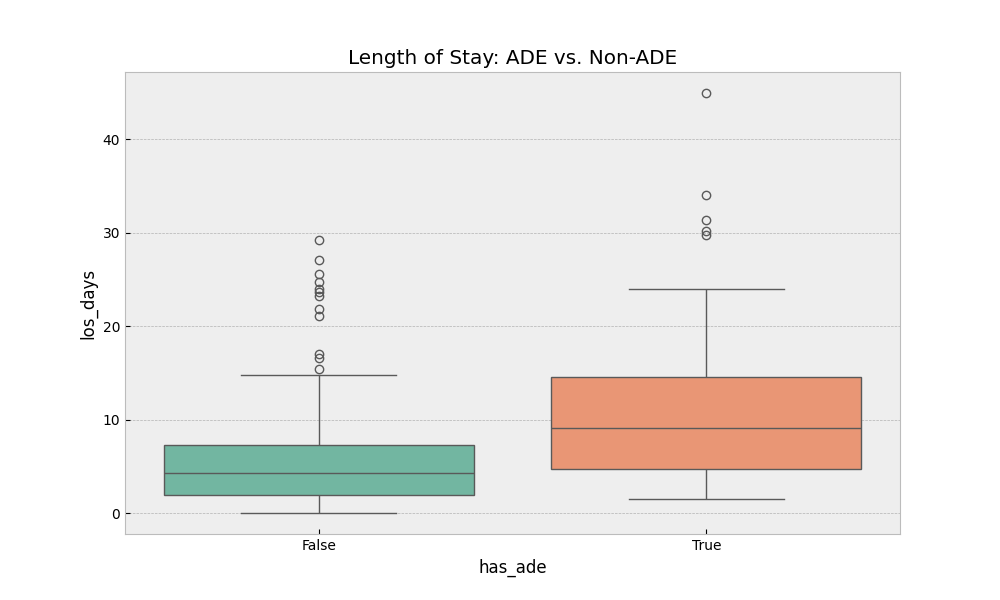
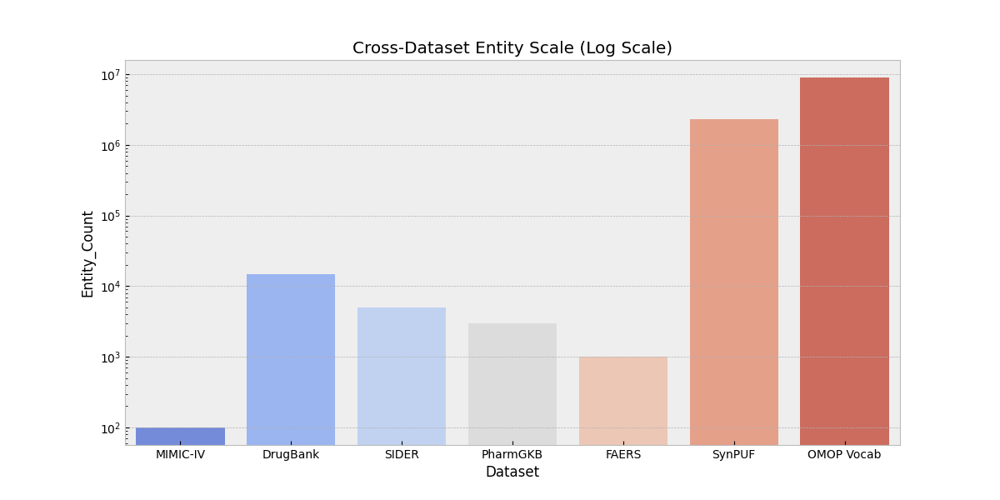

# Adverse Drug Event (ADE) Detection & Integration Hub

A comprehensive research pipeline for identifying Adverse Drug Events (ADEs) by integrating 7 multi-source medical and chemical datasets using the OMOP Common Data Model (CDM).

## 🚀 Overview

This project provides a standardized framework to:
1.  **Acquire Data**: Automated scripts for downloading clinical (MIMIC-IV), chemical (DrugBank), side-effect (SIDER), genomics (PharmGKB), and claims data (SynPUF).
2.  **Harmonize Vocabularies**: Map heterogeneous identifiers to **RxNorm** (Drugs) and **SNOMED/ICD-10-CM** (Conditions) using the OMOP `CONCEPT` spine.
3.  **Detect Signals**: Identify ADEs using temporal clinical logic (e.g., AKI and Bleeding signals in MIMIC-IV).
4.  **Analyze Impact**: Visualize clinical outcomes, such as the **double Length of Stay** for patients experiencing ADEs.

## 🛠️ Project Structure

```text
.
├── EDA/                        # Exploratory Data Analysis Notebooks
│   ├── 01_omop_vocab_eda_enhanced.ipynb
│   ├── 02_synpuf_eda.ipynb
│   ├── 03_faers_eda.ipynb
│   ├── 04_sider_eda.ipynb
│   ├── 05_drugbank_eda.ipynb
│   ├── 06_pharmgkb_eda.ipynb
│   ├── 07_mimic_iv_demo_eda.ipynb
│   └── 08_cross_dataset_integration_eda.ipynb  <-- MASTER INTEGRATION HUB
├── download_drugbank.py        # Individual data acquisition scripts
├── download_faers_concurrent.py
├── download_mimic_demo.py
├── download_omop.py
├── download_pharmgkb.py
├── download_sider.py
├── download_synpuf_2.3m.py
├── main.py                     # Orchestration script
├── requirements.txt            # Python dependencies
└── .gitignore                  # Data/Venv exclusions
```

## 📂 Dataset Catalog

This project integrates 7 distinct data sources to provide a 360-degree view of drug safety and clinical outcomes.

### 1. MIMIC-IV Demo (Clinical)

- **Source**: PhysioNet (MIMIC-IV v2.2 Demo)
- **Content**: De-identified EHR data from patients at Beth Israel Deaconess Medical Center.
- **Key Tables**: `admissions`, `patients`, `diagnoses_icd`, `prescriptions`.
- **Role**: Provides the clinical ground truth for ADE detection using temporal logic.

### 2. DrugBank (Chemical/Pharmacological)

- **Source**: DrugBank Online (v5.1.12)
- **Content**: Comprehensive drug and drug-target database.
- **Role**: Used for mapping proprietary chemical identifiers to RxNorm and understanding drug-target interactions.

### 3. SIDER (Side Effects)

- **Source**: Side Effect Resource (SIDER 4.1)
- **Content**: Information on marketed medicines and their recorded adverse drug reactions (ADRs).
- **Format**: MedDRA-coded terms linked to drug molecules.
- **Role**: Provides the "expected" side effect profiles for validation against clinical signals.

### 4. FAERS (Public Reporting)

- **Source**: FDA Adverse Event Reporting System
- **Content**: Millions of reports of adverse events, medication errors, and product quality complaints.
- **Structure**: `DEMO` (Demographics), `DRUG` (Medications), `REAC` (Reactions).
- **Role**: Provides post-marketing safety data from the real world.

### 5. PharmGKB (Pharmacogenomics)

- **Source**: Pharmacogenomics Knowledgebase
- **Content**: Curated genomic data including clinical variants, drug-label annotations, and genotype-phenotype associations.
- **Role**: Adds a genomic layer to explain *why* certain patients may be more susceptible to ADEs.

### 6. SynPUF 2.3M (Claims)

- **Source**: OMOP Synthetic Public Use File (SynPUF)
- **Content**: Synthetic longitudinal claims data representing 2.3 million Medicare beneficiaries.
- **Role**: Validates identified ADE signals at a population scale in a standardized OMOP format.

### 7. OMOP Vocabulary (Standardization)

- **Source**: OHDSI Athena (RxNorm, SNOMED, ICD-9/10, MedDRA)
- **Content**: The "Rosetta Stone" of medical data, containing over 9 million concepts and their relationships.
- **Role**: Serves as the master integration spine for all datasets.

## 📥 Acquisition Scripts

Each dataset has a dedicated, robust download script:
- `download_mimic_demo.py`: Handles PhysioNet authentication and recursive extraction.
- `download_drugbank.py`: Acquires chemical links and structure files.
- `download_sider.py`: Downloads MedDRA-coded side effect TSVs.
- `download_faers_concurrent.py`: Uses multi-threading to fetch quarterly reports from the FDA.
- `download_pharmgkb.py`: Safely extracts complex genomic directories.
- `download_synpuf_2.3m.py`: Fetches population-scale synthetic claims data.
- `download_omop.py`: Downloads the core vocabulary files from Athena.

## 📊 Visual Gallery (Integrated Analysis)

The following visualizations illustrate the key findings from the Master Integration Notebook (`EDA/08_cross_dataset_integration_eda.ipynb`).

### 1. ADE Signal Distribution
Identification of AKI and Bleeding signals across different trigger drugs in the MIMIC-IV demo dataset.


### 2. Patient Demographics
Age and Gender distribution for patients where an ADE signal was identified.


### 3. Top Diagnosis Codes
A breakdown of the most frequent ICD-10-CM / ICD-9-CM codes contributing to the detected signals.


### 4. Drug-ADE Interaction Matrix
Heatmap showing the correlation between specific medications and types of adverse events.


### 5. Clinical Impact: Length of Stay
Boxplot comparing the hospital stay duration for ADE vs. Non-ADE admissions, revealing a significantly higher LOS for ADE cases.


### 6. Cross-Dataset Coverage
A log-scale comparison of the volume of records and entities across all 7 integrated sources.


## 📊 Analysis Hub

The **Master Integration Notebook** (`EDA/08_cross_dataset_integration_eda.ipynb`) executes the follow pipeline:
- **Normalization**: Maps all 7 sources to a common concept space (RxNorm).
- **ADE Discovery**: Implements temporal joins to identify AKI and Bleeding signals.
- **Demographics**: Analyzes age, gender, and clinical outcomes (LOS).
- **Coverage**: Visualizes the intersection of data across all sources.

## 📈 Key Clinical Insights

- **MIMIC-IV Results**: Successfully identified **140 ADE signals** (AKI and Bleeding).
- **LOS Impact**: Patients with detected ADEs had an average hospital stay of **11.6 days**, compared to **5.6 days** for those without.

## ⚙️ Setup

1. Create a virtual environment: `python -m venv venv`
2. Activate it: `venv\Scripts\activate` (Windows)
3. Install dependencies: `pip install -r requirements.txt`
