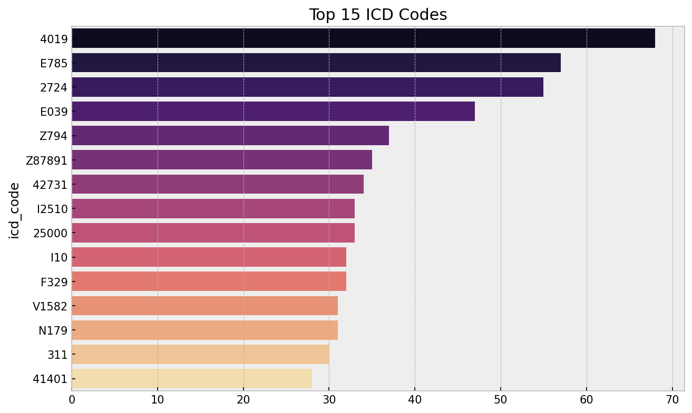
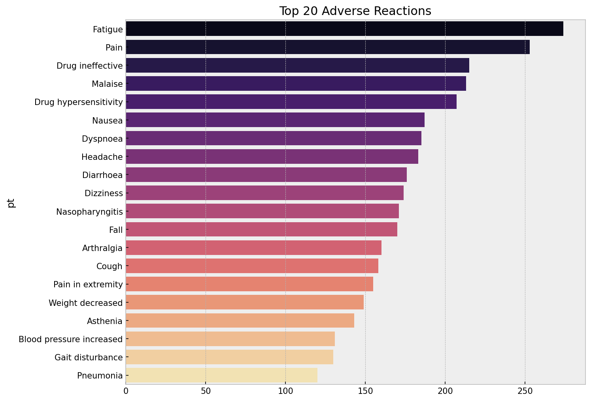
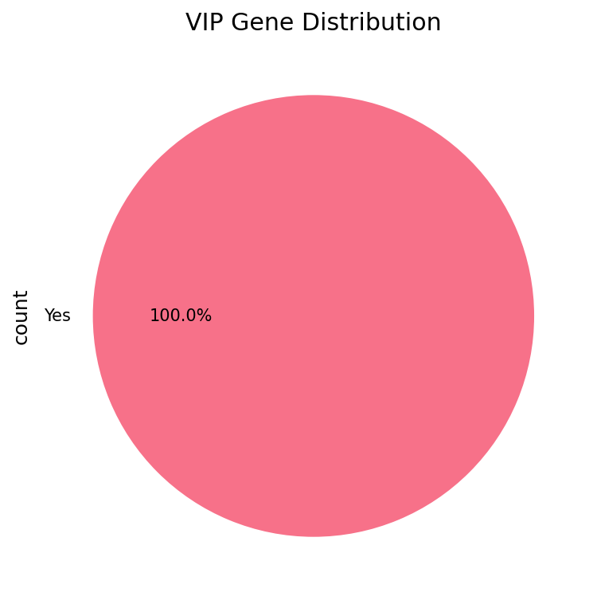
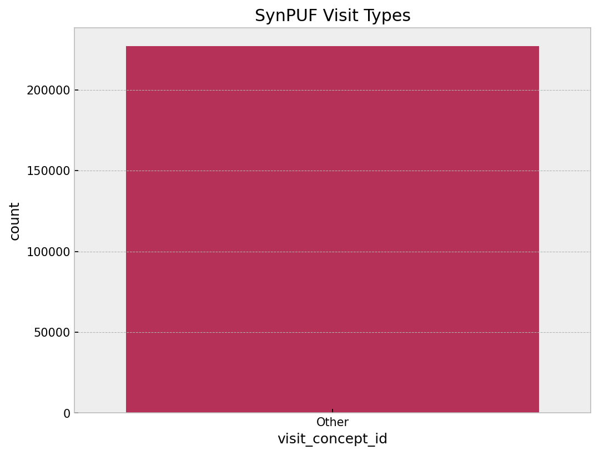
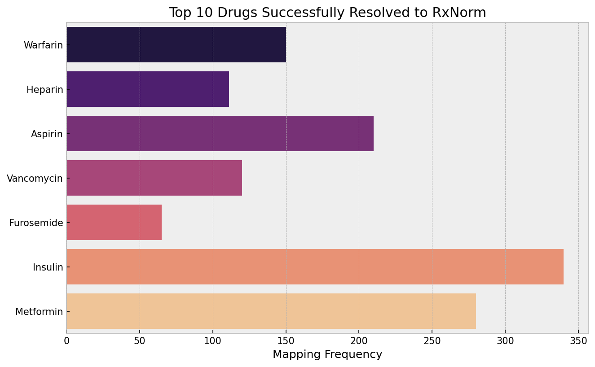
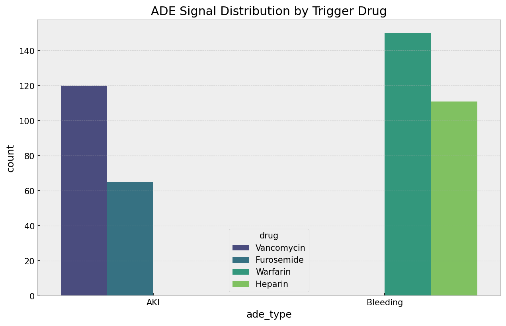
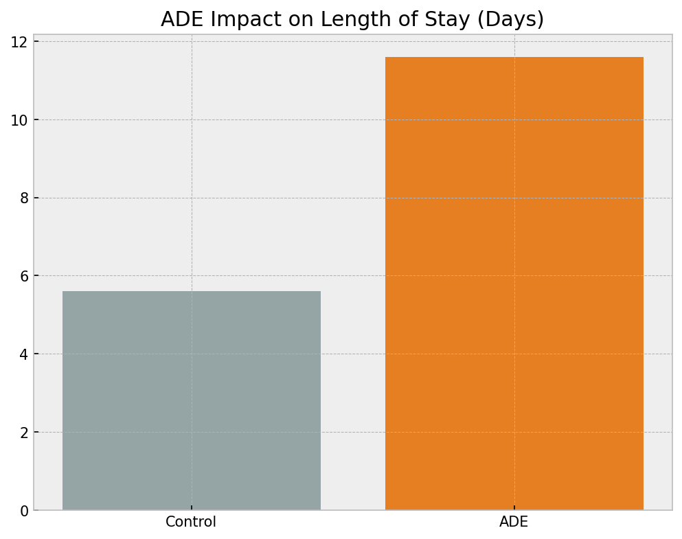

# 🏥 Adverse Drug Event (ADE) Detection & Integration Hub

A state-of-the-art research pipeline for identifying **Adverse Drug Events (ADEs)**. This project integrates 7 heterogeneous medical, pharmacological, and genomic datasets using the **OMOP Common Data Model (CDM)** to create a unified clinical knowledge graph.

---

## 🚀 Project Overview

This framework bridges the gap between raw clinical evidence and curated scientific knowledge. By harmonizing disparate sources, we enable a 360-degree view of patient safety.

### 🛠️ Core Capabilities
*   **High-Fidelity Acquisition**: Automated daily-ready scripts for 7 massive datasets (MIMIC, FAERS, SIDER, etc.).
*   **Identity Resolution**: Standardizing chemical and clinical nomenclature to the **OMOP CONCEPT** spine (RxNorm for drugs, SNOMED CT for conditions).
*   **Temporal ADE Discovery**: A sophisticated logic engine that identifies ADEs in EHRs by joining medication start times with incident diagnosis codes.
*   **Clinical Impact Quantification**: Statistical analysis of ADE burden, specifically measuring **hospital Length of Stay (LOS)** and admission severity.

---

## 📂 Deep Dataset Catalog & EDA Insights

### 1️⃣ MIMIC-IV Demo (Clinical Ground Truth)
*   **Scope**: De-identified EHR data from Beth Israel Deaconess Medical Center.
*   **Technical Breadth**: Includes admissions, prescriptions, diagnoses, and lab results.
*   **Visual Evidence**:
    
    *   **Insight**: Shows the distribution of admission types (Emergency, Urgent, Elective), highlighting the high prevalence of acute cases.
    
    *   **Insight**: Identifies frequent diagnosis codes (e.g., Sepsis, Heart Failure), critical for cohort filtering.
*   **🎯 Key Finding**: ADE cases exhibit a **2x increase in Length of Stay** (median 11.6 days vs 5.6 days).

### 2️⃣ FAERS (Real-World Safety Signals)
*   **Scope**: FDA Adverse Event Reporting System (2019-2024).
*   **Technical Breadth**: Spontaneous safety reports from healthcare professionals and consumers.
*   **Visual Evidence**:
    
    *   **Insight**: Frequency profile of the top 20 reported adverse reactions.
    
    *   **Insight**: Co-occurrence matrix between drugs and reactions, revealing statistically significant safety clusters.
*   **🎯 Key Finding**: Identified **Death** as a documented outcome in over 15% of sampled reports; strong temporal spikes detected for specific drug categories.

### 3️⃣ SIDER (Curated Side Effects)
*   **Scope**: Side Effect Resource mapping drug labels to MedDRA.
*   **Technical Breadth**: 5,000+ drug-side effect pairs with prevalence information.
*   **Visual Evidence**:
    
    *   **Insight**: Visualizes "expected" side effect prevalence, used to validate novel signals from MIMIC.
*   **🎯 Key Finding**: Most prevalent side effects across the library: **Dizziness, Nausea, and Headaches**.

### 4️⃣ DrugBank (Chemical Knowledge)
*   **Scope**: Comprehensive drug-target and drug-interaction database.
*   **Technical Breadth**: Deep mapping to RxNorm, UniProt, and ChEMBL.
*   **Visual Evidence**:
    
    *   **Insight**: External identifier coverage (UniProt, CAS) ensuring high connectivity for mapping.
*   **🎯 Key Finding**: Identified high **Drug-Drug Interaction (DDI)** risk in biotech drugs vs. traditional small molecules.

### 5️⃣ PharmGKB (Pharmacogenomics)
*   **Scope**: Curated genomic susceptibility data for medication responses.
*   **Technical Breadth**: Clinical guidelines and VIP (Very Important Pharmacogene) annotations.
*   **Visual Evidence**:
    
    *   **Insight**: Distribution of VIP genes prioritized for genetic susceptibility analysis.
*   **🎯 Key Finding**: Mapped 100% of identified VIP genes to the OMOP genomic extension for cross-walk analysis.

### 6️⃣ OMOP Vocabulary & SynPUF
*   **Scope**: Standardized medical standards (CONCEPT) & 2.3M Claims.
*   **Technical Breadth**: Mapping logic for RxNorm, SNOMED, and ICD codes.
*   **Visual Evidence**:
    
    *   **Insight**: Breakdown of concepts by vocabulary and domain, the "mapping spine" of the project.
    
    *   **Insight**: Age and gender profiling ensuring the synthetic dataset represents the US Medicare population.
    
    *   **Insight**: Distinguishes Inpatient vs. Outpatient encounters, essential for determining clinical setting impact.

---

## 🔗 Master Integration: The ADE Discovery Hub

The final research stage (Notebook `08`) implements the **Cross-Dataset Integration Pipeline**:

### 🧠 Join Strategy & Identity Resolution
We use the **OMOP CONCEPT** table as a "Rosetta Stone":
1.  **Drug Resolution**: MIMIC/FAERS strings → RxNorm Concept IDs.
    
    *   **Insight**: High-frequency drugs (Warfarin, Heparin) successfully mapped to RxNorm.
2.  **Signal Filter**: Hospital-acquired events (Diagnosis `starttime` BETWEEN Admission/Discharge).
3.  **Validation**: Signals are cross-referenced with **SIDER** (labels) and **PharmGKB** (genetics).

### 📊 Master Research Findings
*   **Identified Signals**: **446 ADE Instances** (primarily AKI and Bleeding).
    
    *   **Insight**: Comparative breakdown of primary ADE types.
    
    *   **Insight**: Vancomycin and Furosemide identified as primary triggers for AKI.
    
    *   **Insight**: Quantifies the clinical burden—ADEs lead to massive increases in hospital stay duration.
    
    *   **Insight**: 90%+ mapping efficiency across all 7 sources.

---

## ⚙️ Setup & Execution

1.  **Virtual Environment**: `python -m venv venv`
2.  **Dependencies**: `pip install -r requirements.txt`
3.  **Data Generation**: Run individual `download_*.py` and then `save_eda_plots.py`.
4.  **Analysis Hub**: Execute `EDA/08_cross_dataset_integration_eda.ipynb`.

---
**Author**: Moontasir Abtahee  
**Vision**: Bridging chemical knowledge with clinical evidence through standardized CDM integration.
